# PART 1 – ETL i EDA

En aquesta primera part del projecte es realitza tot el procés d’extracció, neteja i preparació de les dades a partir d’una base de dades MongoDB, amb l’objectiu d’obtenir un dataset final preparat per a tècniques de Machine Learning.

Les dades corresponen a estadístiques de jugadors de la competició FEB3 / Liga EBA.

---

## Preparació de l’entorn i càrrega de dades

Abans d’iniciar el procés d’ETL i EDA, s’ha preparat un entorn MongoDB utilitzant Docker en un servidor Debian, amb l’objectiu de disposar d’una base de dades reproduïble i independent de l’entorn local.

---

### Transferència del backup al servidor

El fitxer de backup de la base de dades FEB (`.archive`) s’ha transferit prèviament al servidor Debian mitjançant **WinSCP**, assegurant que el fitxer estigui disponible localment abans de la restauració.

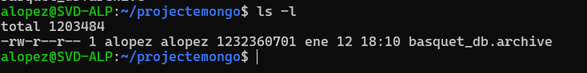

---

### Creació del contenidor MongoDB

S’ha utilitzat la imatge oficial de MongoDB descarregada des de Docker Hub. A continuació, s’ha creat i executat un contenidor MongoDB exposant el port corresponent per permetre connexions externes.

Un cop creat, es comprova que el contenidor està actiu i en execució correctament.

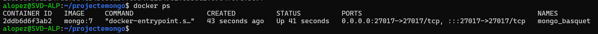

---

### Còpia del backup dins del contenidor

El fitxer `.archive` amb les dades de FEB es copia a l’interior del contenidor MongoDB, garantint que el backup sigui accessible des del sistema intern del contenidor.

Un cop copiat, es verifica la presència del fitxer dins del contenidor.

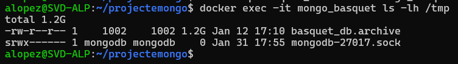

---

### Restauració de la base de dades

Amb el fitxer ja disponible dins del contenidor, es procedeix a restaurar la base de dades mitjançant l’eina `mongorestore`, carregant totes les col·leccions necessàries a la base de dades `feb_db`.

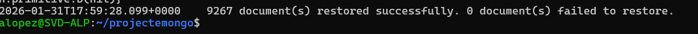

---

### Verificació de la càrrega de dades

Finalment, es comprova que la base de dades s’ha restaurat correctament mitjançant consultes bàsiques amb `mongosh`, assegurant que les col·leccions i registres estan disponibles abans de continuar amb la creació de vistes i l’EDA.

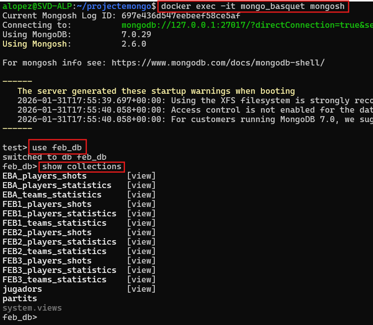

Un cop l’entorn està preparat i la base de dades restaurada correctament, es procedeix a la creació de les vistes necessàries per al procés d’ETL i EDA.

## 🟦 PAS 0 — Definició de les temporades

En primer lloc es defineix una constant amb les temporades més recents disponibles per a la competició FEB3.

Aquesta selecció permet:
- Limitar el volum de dades
- Treballar només amb informació actual
- Garantir coherència en totes les vistes creades posteriorment

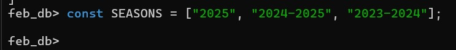

---

## 🟦 PAS 1 — Vista de tirs neta

### Objectiu
Crear una vista amb tots els tirs realitzats a FEB3 durant les temporades seleccionades, amb els camps normalitzats i preparats per a l’anàlisi exploratòria (EDA).

### Procés realitzat

- **$match inicial**  
  Es filtren únicament:
  - Les temporades seleccionades
  - Registres amb `player_feb_id` vàlid

- **$addFields**  
  Es normalitzen alguns camps per evitar inconsistències:
  - `competition_name` es passa a majúscules
  - El tipus de tir (2p / 3p) es normalitza
  - El camp `made` es converteix en un booleà real (`true / false`)

- **$project**  
  Es descarten camps innecessaris i es mantenen només aquells rellevants per:
  - Anàlisi espacial (coordenades X/Y)
  - Anàlisi per zones de tir
  - Càlcul de percentatges d’encert

- **$match final**  
  Comprovació final per assegurar que totes les dades compleixen els criteris definits.

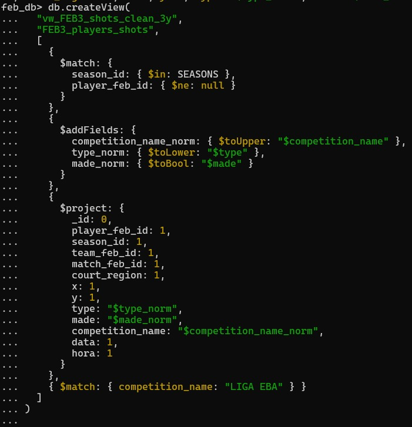

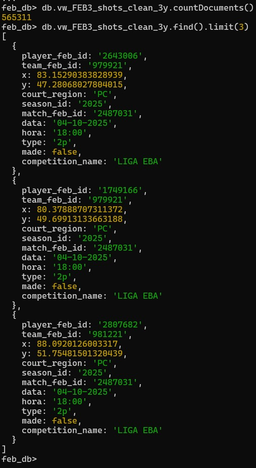

---

## 🟦 PAS 2 — Vista d’estadístiques jugador-partit neta

### Objectiu
Crear una vista amb les estadístiques reals dels jugadors en els partits disputats, preparada per ser agregada posteriorment a nivell de jugador.

### Procés realitzat

- **$match**
  S’eliminen:
  - Jugadors amb `minutes = 0` (no han participat)
  - Registres sense identificador de jugador
  - Temporades fora del període d’estudi

- **$addFields**
  Es converteixen els minuts jugats a un format més interpretable per facilitar l’anàlisi posterior.

- **$project**
  Es seleccionen únicament les variables necessàries per:
  - L’EDA
  - El clustering
  - La creació de noves mètriques

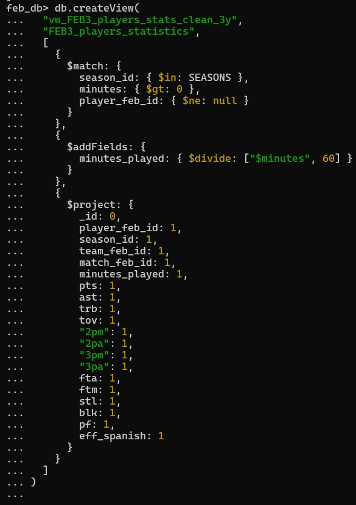

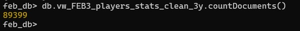

---

## 🟦 PAS 3 — Vista final agregada per jugador

### Objectiu
Obtenir un dataset final a nivell de jugador, amb una fila per jugador i temporada.

### Procés realitzat

- **$group**
  Es realitza una agregació per jugador, calculant:
  - Mitjanes per partit de les principals estadístiques

- **Filtrat per mostra mínima**
  Es descarten els jugadors amb un nombre de partits inferior a un llindar mínim, per evitar soroll en el clustering.

El resultat és un **dataset final net, coherent i preparat per EDA, escalat i entrenament de models**.

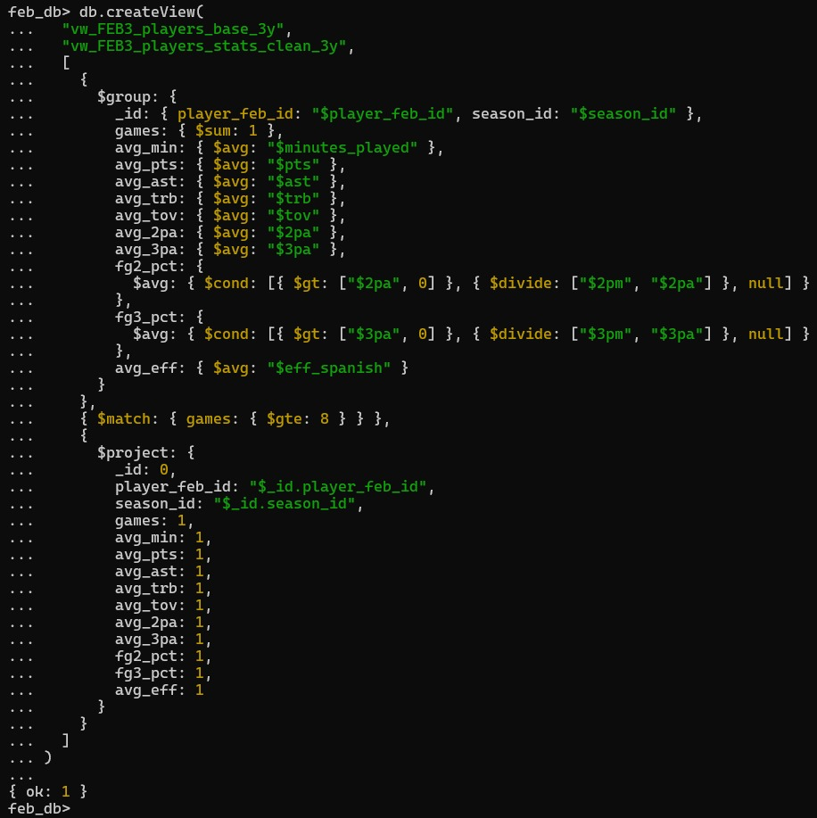

---

## 📓 Playbook ETL i EDA

Tot el procés descrit en aquesta secció es pot consultar i executar al notebook:

- `FEB3_Part1.ipynb`

Aquest playbook conté el codi complet de connexió a MongoDB, creació de vistes, neteja de dades i anàlisi exploratòria, i constitueix la base de dades utilitzada a la Part 2 del projecte.

## Resultat final

El procés ETL finalitza amb la generació d’un dataset estructurat a nivell de jugador, que serveix com a base per a la fase de clustering de la Part 2 del projecte.
